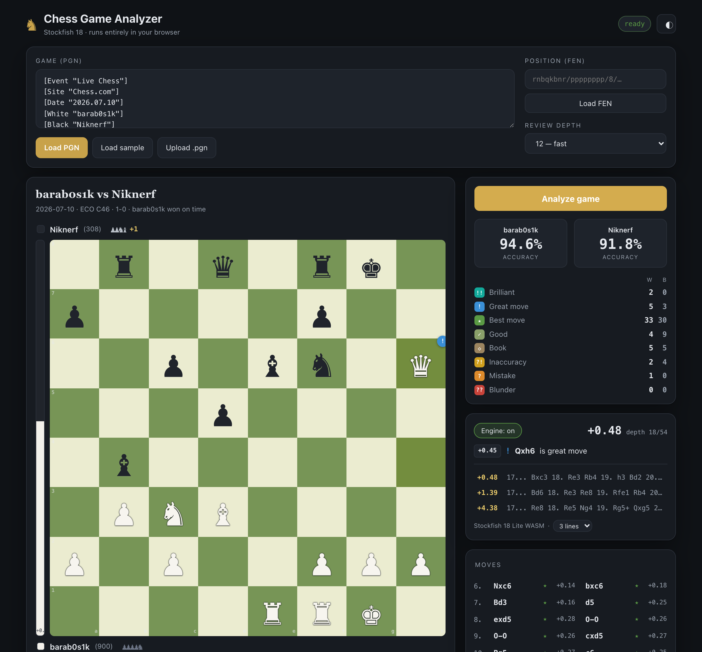

# Chess Analyzer

A game-review tool that runs **Stockfish 18** entirely in your browser (WebAssembly).
Paste any PGN or FEN and get a full analysis — move classifications, per-side accuracy,
an eval bar, captured-material tracking, and live engine lines — with **nothing sent to a server**.

**► Live app: https://barabosik.github.io/chess-analyzer/**



## Features

- **Full game review** — every position is analyzed and each move is labelled
  Brilliant · Great · Best · Good · Book · Inaccuracy · Mistake · Blunder,
  the way an online game review does.
- **Accuracy score** for both sides, plus a breakdown of how many of each move type each player made.
- **Live engine** — the current position is analyzed continuously with multiple principal
  variations shown in real notation, and a clear *"X is best"* suggestion.
- **Eval bar + captured material** — see who's winning and the exact material difference at a glance.
- **Import anything** — paste a PGN (Chess.com / Lichess exports work as-is), upload a `.pgn`
  file, or load a single position from a FEN.
- **Explore lines** — click pieces to play out your own variations from any position;
  the engine follows along. Hit *Return to game* to jump back.
- **Runs offline & private** — the engine is bundled and executes locally via WebAssembly.
  Keyboard navigation (`←` `→` `Home` `End`, `f` to flip), light/dark theme.

## How it works

1. `chess.js` parses the PGN/FEN and generates legal moves and SAN.
2. A single-threaded Stockfish 18 build (compiled to WebAssembly) runs in a Web Worker,
   driven over the UCI protocol.
3. For a review, each position is searched to the chosen depth with 2 principal variations.
   Each move's win-probability loss versus the engine's best line decides its label; sacrifices
   that stay winning are flagged **Brilliant** and critical only-moves **Great**.
   Accuracy is estimated from the average win-probability loss.

Because it's single-threaded WASM, it needs no special server headers and works on plain
static hosting like GitHub Pages.

## Run locally

No build step — it's static files. Serve the folder over HTTP (ES modules and the WASM
worker won't load from `file://`):

```bash
git clone https://github.com/Barabosik/chess-analyzer.git
cd chess-analyzer
python3 -m http.server 8000
# open http://localhost:8000
```

## Project layout

```
index.html            markup + layout
css/style.css         theme tokens, board, panels (light & dark)
js/engine.js          UCI wrapper around the Stockfish Web Worker
js/review.js          full-game review + move classification + accuracy
js/board.js           FEN -> board rendering, highlights, click-to-move
js/app.js             UI state, PGN/FEN import, navigation, live analysis
vendor/chess.js       chess.js (move generation, PGN/FEN)
vendor/stockfish/     Stockfish 18 lite, single-threaded WASM
```

## Adjusting engine strength

Review depth is selectable in the UI (10–18). Higher depth = more accurate labels but slower.
The bundled build is the *lite* net (~7 MB) for fast loading; it is already far stronger than
any human and more than enough for accurate game review.

## Credits & license

- Analysis engine: [Stockfish](https://github.com/official-stockfish/Stockfish),
  compiled to WebAssembly via [nmrugg/stockfish.js](https://github.com/nmrugg/stockfish.js).
- Move generation / PGN: [chess.js](https://github.com/jhlywa/chess.js).

Stockfish is licensed under the **GNU General Public License v3**. Because this project
bundles it, the project is distributed under the **GPLv3** as well — see [LICENSE](LICENSE).
